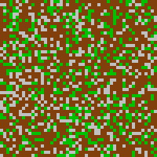
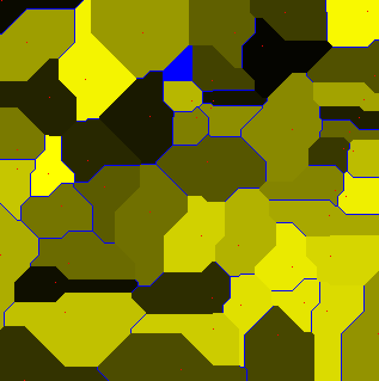
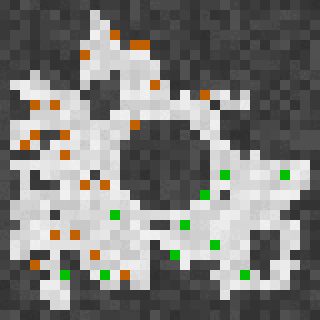

# Advent of Code 2018 in Ada

Because 4 years of pain and suffering aren't enough. :grin:
By the time I got 'round to doing this, I knew Ada's library well enough
that I no longer mention it in the **Tools** subsections
unless it was something truly unusual.

Since the days are somewhat out of order, depending on
whether I tried the example and, if so, when exactly I did,
here's a table of contents with all the days, in order.

* [Day 1](#day-1-chronal-calibration): Chronal Calibration

  Calibrate your mobile time-watch.
* [Day 2](#day-2-inventory-management-system): Inventory Management System

  Identify two boxes with similar id's.
* [Day 3](#day-3-no-matter-how-you-slice-it): No Matter How You Slice it

  Resolve contrasting claims to the fabric in those boxes.
* [Day 4](#day-4-repose-record): Repose Record

  Determine when it's likeliest to be easiest to sneak into a storage room.
* [Day 5](#day-5-alchemical-reduction): Alchemical Reduction

  Reduce chains of polymers.
* [Day 6](#day-6-chronal-coordinates)

  Identify unsafe and safe areas to arrive after time travel.
* [Day 7](#day-7-the-sum-of-its-parts): The Sum of Its Parts

  Assemble Santa's sleigh... efficiently.
* [Day 8](#day-8-memory-maneuver): Memory Maneuver

  Figure out a tree and traverse it.
* [Day 9](#day-9-marble-madness): Marble Madness

  Find the highest scores to games of numbered marbles.
* [Day 10](#day-10-the-stars-align): The Stars Align

  Find a message being spelled out by a point system in the sky.
* [Day 11](#day-11-chronal-charge): Chronal Charge

  Determine the block of cells with the highest power charge
* [Day 12](#day-12-subterranean-sustainability): Subterranean Sustainability

  Analyze the growth patterns of subterranean potted plants.
* [Day 13](#day-13-mine-cart-madness): Mine Cart Madness

  Work out where the elf-drive carts crash.
* [Day 14](#day-14-chocolate-charts): Chocolate Charts

  Hot chocolate recipe scoring and score-matching.
* [Day 15](#day-15-beverage-bandits): Beverage Bandits

  Help the elves defeat the goblins, who want to steal the hot chocolate. Here, "defeat" means "kill or be killed".
* [Day 16](#day-16-chronal-classification): Chronal Classification

  Decipher the time machine's machine code.
* [Day 17](#day-17-reservoir-research): Reservoir Research

  Which underground cells contain water now? Which cells will contain water much, much later?
* [Day 18](#day-18-settlers-of-the-north-pole): Settlers of the North Pole

  Determine how the clear land, woods, and lumberyards evolve over time.
* [Day 19](#day-19-go-with-the-flow): Go with the Flow
  What are the background programs on your time-traveling device up to?!?

## Days I completed without doing the example first

### Day 1: Chronal Calibration

Your mobile time-travel watch wasn't calibrated before you left,
and you need to calibrate it in medias res.

1. Determine the total frequency drift.
1. Determine the first frequency you reach twice.

#### Tools
* The new `'Reduce` attribute with `"+"`.

#### Experience
Fun and easy.

### Day 2: Inventory Management System

Boxes have an ID with five symbols.

1. Determine which Ids repeat two symbols and which have repeat three symbols.
   Some boxes may have fall in both camps; count them twice.
1. Find the two boxes whose symbols differ in only one position.
   Report the common symbols.

#### Tools
Ada 2022's new bracket-initialization syntax for arrays.

#### Experience
Fun and easy.

### Day 5: Alchemical Reduction

You're given a chain of 50,000 polymers with certain units and polarity.
When two adjoining polymers have the same unit but different polarity,
they reduce.

1. Reduce the chain.
1. Identify the unit which, when both its polarities
   are removed from the chain, leads to a shortest reduced chain.

#### Tools
* Discriminated `Polymer` type for the diagnostic.

#### Experience
Fun and easy.

### Day 7: The Sum of Its Parts

You need to assemble Santa's sleigh.

1. Determine the order in which the steps must be done
   when one person is working alone.
1. Determine how long it will take to complete the instructions
   when five people are working together.

Part 2 is made a little trickier
thanks to a time penalty associated with each step:
* Step A: 61 seconds
* Step B: 62 seconds
* ...

#### Tools

I relied heavily on arrays indexed by the subrange of `Character`
corresponding to the steps. It's fairly easy to represent this graph that way.

#### Experience

Largely fun and easy. I made several mistakes,
but the problem was simple enough to "self-debug".

Although I downloaded the example and ran my final implementation on it
to verify that it would produce the correct answer,
I was by that point already fairly confident that my answer was correct,
but competition rules required me to wait five minutes before I tried again.
Having nothing else to do, I tried the example, but I don't feel it belongs
with the usual days where I needed the example to solve the problem.

### Day 9: Marble Madness

The elves play a game with marbles numbered
from 0 to some obscenely high number.
The rules of play depend on whether the marble's number is a multiple of 23:
when it is, the elf keeps the marble
and takes the marble 7 spaces counter-clockwise of the current marble.
The new current marble is the one clockwise of the one just taken.

1. Find the highest score with a certain number of elves and marbles.
1. Repeat when there are 100 times more marbles.

#### Tools
* Again with `'Reduce`, only this time I needed `Long_Long_Integer'Max`.
* I originally solved Part 2 using `Big_Integers` but then realized that
  `Long_Long_Integer` would do the trick fine.

#### Experience
Surprisingly fun and easy, considering it's a Day 9.
For both Day 8 and Day 9 I've had an initial panic when I first saw the problem
and remembered similar problems that had bedeviled me in other years' puzzles,
but for Day 9 I managed the correct answer for both parts on the first try --
setting aside the stack overflow and integer overflow errors
that I first encountered.

### Day 10: The Stars Align

Having trouble getting directions to the North Pole.
There's a system of points arranged in the sky, always in motion.
If you can determine the message it spells out
once the points arrives at the correct position, you're home free, so to speak.

1. Find the message.
1. Find how long the elves would have had to wait before they saw the message.

#### Tools

Nothing special. Probably could have solved it with Ada 83.

#### Experience

Fun and easy. Kind of surprised: two days in a row!
In fact, I had fewer troubles with this day than with just about any other.

### Day 11: Chronal Charge

Time-traveling again, your device warns that it's low on power.
It has a 300x300 grid of cells, and you need to find the block of cells
with the highest power level, where the "power level" is a curious function
of the cell's position.

1. Do this for a 3x3 block.
1. Do this for an arbitrary-sized block.

#### Tools

The "alternate" solution to Part 2 (which is now done first)
builds up the various levels via a kind of recursion.
It's similar to the
[Bareiss algorithm](https://en.wikipedia.org/wiki/Bareiss_algorithm)
for computing a determinant.

#### Experience

Fun and easy. The only difficulty I had with my first implementation of Part 2
was that I needed some patience (it's slow) and then I accidentally typed the
position in wrong (`236,238,11` instead of `236,268,11`).

I then tried to implement Part 2 more efficiently, but kept wrecking that.
Having the first, slow solution working made that more tolerable.

### Day 16: Chronal Classification

You're time traveling again, and your time traveling piece is still acting up.
Let's try to decipher its machine code, to see what's going on.
Start with a bunch of samples of its registers before/after an instruction,
as well as a program.

1. Determine how many samples satisfy at least three opcodes.
1. Decipher the opcodes and report the value of register 0
   after the program finishes executing.

#### Tools
* Arrays of subprograms made Parts 1 and 2 easier.

#### Experience
Fun and easy, though not quite as fun and easy as it should have been.
I misread the question to Part 1, so I got it wrong the first time,
but I quickly worked out my problem.

Part 2 took longer because Ada is a little (too?) picky
when it comes to bitwise oeprations: they can't be performed on integer types,
only on modular types.
I've seen enough arguments about this to know better than to quibble with Ada;
for our purposes, my problem was that I selected too low a modulus,
and didn't realize the number reset until I tried my input
on someone else's solution.
I imagine a lot of Ada programmers would say that the real problem lies
in the problem specification, since it doesn't tell us how large the numbers
might be.

As a final note, this probably doesn't end up in the next section
because there _weren't_ many examples to test,
so what was the point of trying?

### Day 17: Reservoir Research

Even further back in time, you meet elves
who are trying to create the North Pole.
They need water, which is underground.
There's clay, there's sand, and there's a spring at ground level.
Water sinks down from the spring.

1. Determine how many cells
   between the first and last depth levels in the input
   will contain water.
2. Over the long haul, the reservoir will dry up.
   Determine how many cells will retain water.

#### Tools

* `Ada.Containers.Generic_Sorter`

#### Experience

I should have finished this more quickly, but I got hung up on
some special cases. Fortunately, this problem is rather visual, so
I found them myself, with the help of an example I made up. (Included!)

After that, I got stuck on an answer that was just slightly too high,
because I didn't catch the wording about starting from the highest clay block,
not from just below ground level.

#### Visualization

Because it's so large visually, here's a [link](day17/Images/Part1.png).

### Day 18: Settlers of The North Pole

Elves are building in a wilderness of trees, open spaces, and lumberyards.
An acre of one thing can change to an acre of a another thing
depending on what its neighboring acres contain.
Things change quickly: once a minute!

1. Find the resource value after 10 minutes.
1. Find the resource value after 1 billion minutes.

#### Tools

* Basic number theory via modular arithmetic.
* Pretty pleased with how I used arrays indexed by an enumeration.

#### Experience

Fun and easy. One of my daughters worked with me on the problem, and
we had fun with this problem, including the debugging. She doesn't know Ada and
isn't likely to learn much from this, but she learned a bit and helped keep me
on my toes with good questions.

#### Visualization

## Days I tried to solve without the example, but had to give in

### Day 3: No Matter How You Slice It

The elves want to claim rectangles from a very large fabric.

1. Determine the number of square inches with overlapping claims.
1. Identify the one claim that doesn't overlap.

#### Tools
* Custom `Read_Nat` to read natural numbers, thanks to a well-known,
  long-standing Ada ~~bug~~ feature.

#### Experience
I had issues with Ada's unwieldy `Hashed_Maps` API.
I also realized an immense performance improvement by changing
from a badly-chosen hash function to a more reasonable one.

### Day 4: Repose Record

You need to sneak into a storage room.
Every day, one of several guards comes in before midnight,
and during the midnight hour he takes a nap.

1. During what minute does the guard who sleeps most, sleep most?
1. During which minute does some guard sleep most?

#### Tools

* `Ada.Containers.Generic_Sorter`
* The new `'Reduce` attribute with `"+"`.
* I had some issues with generating a discriminated record
  in a `case` statement without branching on every enumeration variant.
  This would be annoying when the enumeration has many variants,
  and multiple variants share the same instructions.
  Some help from the folks at
  [ada-lang.io](https://forum.ada-lang.io/t/initializing-a-discriminated-record/485)
  helped me get over that,
  _and_ introduced me to the idea of an extended return statement.

#### Experience
This took a long time in part because I overthought it at first.
Only check-ins occur on the day before, and they only do that _sometimes_.
Eventually I realized that putting all the "actions" into a vector,
then sorting the vector by its timestamp,
would automatically take care of what I wanted.

The only reason I needed the example
was my misinterpretation of what Part 1 wanted.

### Day 6: Chronal Coordinates

You're traveling through time and approaching different coordinates.
You want to make sure they're safe.

1. If they're dangerous, you want to find the location whose area
   gives the largest distance from other points. Report that area's size.
1. If they're safe, find the size of the area whose points
   all have a sum of distances from the coordinates less than 10_000.

#### Tools
* Already needed a breadth-first search queue for Part 2.
* The new `'Reduce` attribute with `Natural'Max`.

#### Experience
For some reason, my first implementation of part 1 mis-classifies
one coordinate as still claiming positions, even though it's clearly finite,
while another coordinate has the wrong number of points.
I haven't yet figured out why not, since printing the grid shows
the mis-classified coordinate to be clearly finite.

A silver lining is that the second implementation,
which _does_ give the correct answer,
seems simpler and more efficient than the first.

#### Visualization

**Legend**
* Red dots indicate co-ordinates.
* Blue dots are equidistant from coordinates.
* Shades of yellow indicate which coordinate the dot belongs to.

### Day 8: Memory Maneuver

Your device won't give directions because it can't read the license file.
You need to decode it.

1. Report the sum of all nodes' meta values.
1. Report the value of the root node, where the value of a node is:
   * the sum of its meta values when it has no children, and
   * the sum of its legitimate children's values otherwise.

#### Tools
* The new `'Reduce` attribute with `"+"`, but I had already done that
  on days 1 and 4.

#### Experience
This was fun and easy. I got Part 1 right on the first try!
I'm not sure what I was doing wrong in my first attempt with Part 2,
but after I downloaded the example and tinkered with it a little,
I had the right answer.

### Day 12: Subterranean Sustainability

You're in a cavern. Someone's growing potted plants with geothermal heat.
(Curious plants, which don't require sunlight.)
You notice that someone has scribbled the rules of their growth patterns.

1. Report the sum of the indexes of the pots that have plants
   after 20 generations.
1. Report the sum of the indexes of the pots that have plants
   after 50 billion generations.

#### Tools

* I didn't _need_ the `Big_Integers` type to solve the problem,
  but once I had the solution I went ahead and used it
  to generate the solution automatically.
* The plants' growth rate turns out to stabilize eventually;
  in my case, it stabilizes at 21 well before 1,000 generations.
  So it's a simple matter of calculating an arithmetic sum for the number
  of generations remaining after 1,000.

#### Experience

Fun and mostly easy. I made some silly mistakes when I first initialized
both `Rules` and `Initial_State`, and rather than analyze it
with unknown data I downloaded the example and work with that.
The bugs were relatively easy to fix, so perhaps I should have kept at it
without working the example.

### Day 13: Mine Cart Madness

Elves push carts around on tracks, heedless of their eventually crashing.

1. Report first crash's location.
1. Report the last surviving cart's location.

#### Tools

* `Ada.Containers.Generic_Sorter`

Nothing else I'm not used to by know.

#### Experience
* Part 1 was easy, but implementing it was a bit tedious.
  I don't _think_ I over-engineered it, and
  I had the right answer on the first try, which would seem to support that.
  (I did neglect to convert the original output,
  which was in positive coordinates, to the puzzle's desired format,
  which is in natural coordinates. The final program does that automatically.)

*  Part 2 was also easy, but I overlooked a detail in the instructions.
   An important caveat is that the carts move in a certain order:
   topmost cart, breaking ties leftmost.
   My struggles with this made me try the example, but of course
   it's trivial enough that this constraing doesn't matter.
   It was only after looking at the Reddit page discussion
   that I saw this specified in the directions.

* Doing the example didn't help me solve the problem,
  but technically I _did_ the example, so this puzzle lies in this section.

#### Visualization

I'd like to do this eventually, but I haven't done it yet.

### Day 14: Chocolate Charts

Elves are making hot chocolate and are scoring recipes, which recombine.
The scores range from 0 to 9.

1. What are the ten recipe scores once you make the number of recipes
   in the puzzle input?
1. How many recipes must be made before they arrive at a sequence of recipes
   whose digits are precisely those of the puzzle input?

Don't ask me why they don't quit once they attain a score of 9.

#### Tools
Nothing special.

#### Experience
Not too hard. I misread the question in Part 1, so I tried the example, but
of course that didn't help, so I read some commentary online.
Someone mentioned getting a very wrong answer when using the puzzle input
as the first recipes, and go figure, that was precisely my problem.

I thought Part 2 would be harder than it turned out to be.

### Day 19: Go With The Flow

1. A background program is working on your device,
   and you'd like to figure out what it's up to.
   Run the program and report the contents of register 0.
1. The same program suddenly boots up again, this time with a 1 in register 0.
   Determine the contents of register 0 when it finishes.

#### Tools

* The virtual machine from Day 16, though you don't have to reverse engineer it
  this time.
* For Part 2, you need either an immense amount of patience, or a JIT,
  or an analysis of what the machine instructions are trying to do.

#### Spoiler alert

The machine instructions set up a ginormous number n,
then compute σ(n), the sum of its factors.

#### Experience

* Part 1 was fine, though my first attempt was incorrect thanks to the modulus
  I used on Day 16 not being sufficiently high this time.
  So, I cranked up the number a few times until cranking it up higher
  no longer changed the final result, figuring that that meant I was not longer
  overflowing the modulus.
  If I recall correctly, 2 million suffices,
  but I have it set for 4 million instead.

  This is where I decided to try the example. It didn't help at all,
  except to convince me that I had implemented it correctly
  and needed to think about the implementation more deeply.
  I immediately suspected something about the modular type, and I was correct.
  Again I find myself wishing either that Mr. Wastl would be more precise
  about the machine (e.g., word size) or that Ada would let me perform bitwise
  arithmetic on regular integer values.

* Part 2 was more challenging, because it sits there a **loooooong** time doing
  seemingly nothing, and if you debug it a little to see what's going on,
  it becomes clear that a ginormous number is involved.
  I looked online for hints and saw that many people decided to dis-assemble
  the code and then analyzed its behavior, so I tried that, at which point
  it became clear that it's basically the following pseudocode:

      determine a ginormous number (details omitted)

      for r1 in 1 .. ginormous
         for r5 in 1 .. ginormous

            if r1 x r5 = ginormous
               --  aha! r1 is a factor of ginormous; add it to result
               add r1 to r0
            end if

            add 1 to r5

            if r5 > ginormous then
               break from "for r5"
            end if

         end "for r5"

         if r1 > r3 then
            break from "for r1"
         end if

      end "for r1"

  In other words, it's summing the factors of `ginormous` in r0.
  I already knew what `ginormous` was, so I could have done it by hand
  (er... with _some_ difficulty) but I still decided I'd like to automate
  Part 2, so I did:
  
  * At first I set it up to run the program until some register
    was larger than 1 million, then performed the sum of its factors
    via a rather lame `for` loop, but that turned out to be a bad idea
    (as I really should have known, since I had worked the setup out by hand
    and could see that the summation doesn't start until
    there are _two_ numbers larger than 1 million).
  * Then I waited until register 3 islarger than 1 million,
    since my program sets up `ginormous` in register 3. That worked great!
  * However, while I'm pretty sure everyone will have a program that computes
    the sum of the factors of a ginormous number, it's also quite possible that
    not everyone would have the target number in register 3,
    so I reworked it again to quit the virtual machine
    once it arrives at line 3 (the inner loop) and to find the sum based on
    the largest number it finds in some register,
    which might be any different register.

## Days I completed only after doing the example first

### Day 15: Beverage Bandits

Goblins are stealing the elves' hot chocolate. The elves plan to defend it.
This is a surprisingly morbid puzzle, with critters really dying!
Both sides adhere to a very strict rule of combat,
and the combat ends only when every enemy is dead.

The elves, alas, are greatly outnumbered.

1. What is the outcome under the default abilities?
   Here, "outcome" is defined as the last full round
   where the losing team plays,
   multiplied by the sum of the survivors' hit points.
1. What attack strength would the elves need to win
   _without losing a single elf_?

#### Tools
1. I used breadth-first search.
1. `Ada.Containers.Generic_Sorter`

#### Experience
The moment I looked at this and realized
it would require search through a maze,
I figured it would moitilize me,
so of course I resolved to try the examples first.

No point in sugarcoating it: _even the examples_ moitilized me.

Just getting the breadth-first search set up and running took me four hours --
and that turned out to be _erroneous_,
because I hadn't read the rules carefully enough, _despite trying!_
There are just so many words... I mean, look, it's my fault, sure;
I need to read more carefully, and outline the important parts myself,
but this really could have been described more efficiently,
and the examples could have shown more intermediate steps.
In fact, I'm lucky; reading the comments online,
it appears that the original version had a _really_ poor choice of words
that misled many readers.

I was "lucky" in the sense that I couldn't get the examples to work.
Reading comments online helped a little, but in the end I had to give up and
tried a couple of solutions to see if they would help.
Two C++ solutions failed to help -- one gave the wrong answer _on an example_,
while the other seg-faulted out of the gate.
Fortunately,
[a Python example](https://www.reddit.com/r/adventofcode/comments/a6chwa/2018_day_15_solutions/ebtwcqr/?utm_source=share&utm_medium=web3x&utm_name=web3xcss&utm_term=1&utm_content=share_button)
worked just fine! and I was able to find my errors by comparing behavior.

##### :warning: Caution! :warning:
-- That said -- the linked Python program may have a small error.
I saw a discrepancy in a couple path choices where I'm quite sure
this code makes the right choice. In one example, a goblin at (12,8)
chose to move to (13,8), when a choice of (12,9) was available
_and_ would take it to the same destination.
That's definitely incorrect, but the discrepancy resolved itself quickly
and both solutions attain the same answers, so... I dunno!

All that aside, I like the puzzle!
As I recall, I was guilty of "only" four errors I didn't detect myself,
three of which seem to be common:

1. Preference is given to a path with the "smallest" _target_ cell,
   not the smallest _first_ cell; though ties on the target are indeed
   broken in favor of a path with the "smallest" _first_ cell.
1. I didn't properly handle the case when all enemies die mid-round.
1. I conflated end-of-turn and end-of-game.
1. The `Explored_Routes` cache needed for Breadth-First Search
   needs to be updated correctly when a better path is available.
   If I recall correctly, in my case I was neglecting to store the first step.

I also hit a huge bottleneck once I had the correct search algorithm, as
I was checking only paths ready to queue were suboptimal.
One also needs to check whether freshly dequeued paths are suboptimal.

#### Visualization

##### Part 1 #####

##### Part 2 #####
